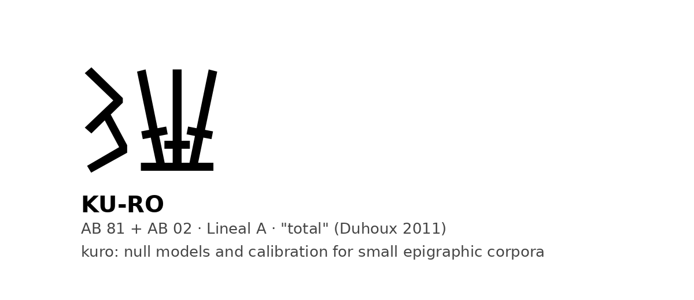

<p align="center"></p>

# kuro

**KU-RO** (𐙂𐘜, AB 81 + AB 02) is the Linear A word for "total": the one word everyone reads, and the one proven by arithmetic. kuro is a Python package that does for small epigraphic corpora what KU-RO does for a tablet: it adds things up and says what the total supports.

It does not decipher. It answers, with a permutation null behind every claim, what a corpus can and cannot support: whether two groups of documents differ in register beyond the sampling floor; whether an affix forms root/derivative pairs above chance; whether sign-strings co-occur or exclude one another against a fixed-margin null; whether a vocabulary is compartmented by document type or by scribal hand; whether totals add up; and whether form matches with an external lexicon exceed what shuffled syllables produce. It also mines expert commentaries for expressions of doubt, so that tests can be aimed where specialists stopped.

## Install

```
pip install pykuro        # the distribution is called pykuro; the module is kuro
```

## Quickstart (Linear A, LinearA Explorer JSON)

```python
from kuro import load_lineara, profile_distance, affix_pairs, metacommunity, confounder_jaccard, totals_check
docs = load_lineara('inscriptions.json')
tablets = [d for d in docs if d.support == 'Tablet' and d.site == 'Haghia Triada']
vocab = sorted(set(w for d in docs for w in d.words()))
affix_pairs(vocab, 'ka', 'prefix')      # {'observed': 5, 'null_mean': 1.4, 'p': 0.01, ...}
totals_check(next(d for d in docs if d.id == 'HT117a'))   # KU-RO 10 = ten names with 1
```

See `examples/linear_a_quickstart.py`. The corpora themselves are fetched with `python3 data/fetch.py` (see `data/README.md` for sources and licences); `data/derived/` holds the tables produced by this project. Loaders also exist for CDLI ATF exports (Proto-Elamite, proto-cuneiform) and CSV text tables (Iberian, Etruscan).

## What it has been calibrated on

Etruscan (genitive before *clan*, syncope by period, sibilants by city), Eteocypriot vs Cypriot Greek (word-final syllables), Proto-Elamite (Dahl's numeral systems by object class, the M157 header, the name/commodity partition), Uruk vs Susa (inheritance of the sexagesimal system, adaptation of the capacity system, invention of the decimal), Iberian (Untermann's onomastic formants, the southern S56 and north-eastern -mi isoglosses). Its use on Linear A is reported in the papers under `docs/papers/`.

## Since 10 September 2026

Twelve instruments now carry a measured error rate (`data/derived/error_rates.json`), including the
quantity-profile test for logograms (`kuro/profile.py`) and the name matcher with its nulls
(`kuro/names.py`). The functional inventory (`data/derived/dictionary.json`) holds 56 units with
evidence for and against and a refutation condition each; 276 of 783 syllabic units are flagged as
broken in every attestation. The sound-value search (`kuro/valuesearch.py`, `scripts/value_search.py`)
optimises the values of the unanchored Linear A signs against each candidate language with a control
corpus; no candidate beats the control (z max 1.7). Two model-in-the-loop stages are measured: the
literature Reader (`kuro/reader.py`, 22% invented units without a dossier) and the Hypothesizer
(`kuro/hypothesize.py`, 1% with one), both judged by `scripts/cycle_*.py`. Calibrations on Iberian
(Ascoli bronze anchoring, ending profiles) are under `docs/analysis/`.

## Reports

```
python -m kuro report HT23a          # what is known about a document, and what is not
python -m kuro sign CYP              # where a sign occurs, with what, with p-values
python -m kuro arithmetic HT117a     # totals that add up, and fixed ratios
python -m kuro verify HT23a          # what to check against the primary edition, and why
python -m kuro capture site          # does a group difference track how the data was recorded?
python -m kuro classify --out c.csv  # classify every document by content, not by support
python -m kuro power --documents 224 --tokens 2481   # what a corpus this size can support
```

A report lists each element of a document with its state — established reading, function fixed by arithmetic or position, or unidentified — its quantity, the proportions normalised to the smallest fraction, and the arithmetic that checks. It proposes no readings: it states what the corpus supports and what it leaves open. Sign profiles give company, position, quantities and hypergeometric p-values against the commodity classes; association is not identification, and the report says so.

Every report ends with a verification sec
## What is in this repository

| path | what it holds |
|---|---|
| `kuro/` | the package: corpus loaders, nulls, tests, reports, provenance, power thresholds |
| `tests/` | 106 tests on synthetic data with known answers, plus the manifest and language-pair checks |
| `manifest.json` | every figure the papers assert, the withdrawn claims, the prior art and its holders |
| `scripts/check_manifest.py` | reads the papers and fails when any of those drifts |
| `biblio/` | which work bears on which claim, and whether it has been read |
| `docs/papers/` | the papers as PDFs; `sources/` holds the Markdown they are built from |
| `docs/analysis/` | the analyses behind every claim in the papers, in the order they were made |
| `docs/state/` | where the work stands, what is unchecked, whom to write to, what to obtain |
| `docs/REGISTRO_cambios.md` | what was done each day and why |
| `data/raw/` | corpus sources, with `README.md` recording provenance and what may be redistributed |
| `data/derived/` | derived data: the content classification, the 2019 classification, the Etruscan corpus |
| `docs/IDEAS.md` | things worth doing later, each with the condition that would make it worth the work |

tion. It flags three patterns, each of which produced a false result in our own work: an integer quantity where the same sign normally carries a fraction; a sign-group split by a line break that joins into a word attested elsewhere; and a rare ligature built on a frequent word. It fires on 0.3% of the Linear A corpus, and the three documents that misled us are among them. Signs are verified at sigla.phis.me; the primary edition, GORILA, is not machine-readable.

## Where the figures come from

Every figure a report states carries its provenance: `[C]` computed from the loaded corpus in this
session (reports print the corpus SHA-256, so two runs on different files cannot be confused),
`[L]` taken from the literature and cited, `[~]` illustrative and not verified here. The practice is
adopted from Briakos (2026). It matters because a measured 26-28% yield and a recalled "olive oil
gives 15-25%" must not read alike.

And before any comparison between groups, `capture_control` asks whether the groups differ in how
much text survives per document. On Linear A the answer is yes — document length spreads 311% across
sites and 274% across supports — so profile comparisons must be matched on length. Briakos (2026)
found the corresponding trap in the visual domain, where an apparent geographic separation tracked
photographic brightness at r = 0.990.

## Tests

```
pip install -e ".[test]"
pytest -q          # 106 tests on synthetic data with known answers
```

Each test plants a structure (a register difference, a prefix, mutually exclusive blocks, a vocabulary that depends on the hand, a tablet whose total adds up) and checks that the instrument sees it and that the nulls preserve what they must: margins, word lengths, strata.

## Function reference

| function | question it answers |
|---|---|
| `profile_distance(A, B)` | do two groups of documents differ in register beyond the sampling floor? |
| `affix_pairs(vocab, affix, kind)` | does an affix form root/derivative pairs above chance? |
| `family_positions(strings)` | do particular signs concentrate at the start or end of long strings? |
| `metacommunity(docs)` | which strings co-occur or exclude each other against a fixed-margin null? |
| `monopolies(docs, type_of)` | which vocabulary is exclusive to one document type? |
| `confounder_jaccard(docs, a, b)` | is shared vocabulary explained by factor a or by factor b? |
| `totals_check(doc)` | do the quantities of a section add up to its total? |
| `form_screen(vocab, catalogue, match)` | do form matches with an external lexicon exceed shuffled syllables? |
| `hapax_by_length(docs)` | how does the singleton rate vary with string length? |
| `doubts(glob)` | where does an expert commentary express doubt? |
| `Corpus.tablet_report(id)` | what is known about this document, and what is not? |
| `Corpus.sign_profile(sign)` | where does this sign occur, with what, with what significance? |
| `Corpus.arithmetic_check(id)` | do the totals add up, and are there fixed ratios? |
| `Corpus.classify(doc)` | is this document accounting, votive, a label, or indeterminate? |
| `Corpus.verify(id)` | what in this document should be checked against the primary edition, and why? |
| `power_report(n_documents, n_tokens)` | which instruments have power at this corpus size, and which do not? |
| `capture_artifact(docs, signal, capture)` | is this difference a property of the data or of how it was captured? |
| `group_cohesion(items, labels, features)` | does a proposed classification capture real structure, or the classifier's categories? |
| `factor_effects(items, factors, features)` | which of several confounded factors explains shared features, and which is redundant? |
| `Fact.computed / cited / illustrative` | a number with its provenance, so measured and remembered figures never mix |
| `Corpus.capture_control(factor)` | does a difference between groups track how the documents were recorded? |

## Provenance of figures

Every figure a report states carries a marker: `[C]` computed here, with the hash of the source file; `[L]` taken from the literature, with the source named; `[~]` illustrative only. The practice is adapted from Briakos (2026), who labels each statistic in his thesis the same way. A report that mixes a measured value with a remembered one is the easiest kind of work to discredit and the hardest error to see from inside.

## Corpus size

`power_report` states which instruments have power at a given size, with the evidence for each threshold: co-exclusion needs around 800 documents (zero pairs at 224, thirteen at 830), a network descriptor with test-retest reliability needs tens of thousands (noise at 224, 2.9% between halves at 34,000), and frequency rank-matching for phonetic values needs around 10,000 sign tokens — that last one from Briakos (2026), who calibrates it against a synthetic Linear B corpus.


## Look it up before you measure it

In one week this project measured something, concluded something, and then found the conclusion
already published — six times. Twice it was in Younger's *Lexicon*, which catalogues the corpus word
by word and is freely available. `kuro.Reference` makes that lookup take a second:

```python
from kuro import Reference
ref = Reference('docs/reference')
print(ref.lookup('KU-NI-SU'))                      # what the literature already says
print(ref.unread(['*305', 'KI-RE-TA-NA']))         # which of these are untouched
```

The reference texts are not redistributed; `docs/reference/README.md` says which works to obtain and
how to extract them. When the folder is empty the lookup says so, rather than reporting an absence
that would read as novelty.


## The hypothesis cycle

Three claims were made and killed on 9 September 2026. Each took hours; each died at a different
step; the steps were the same every time and were carried out by hand. `kuro.Hypothesis` is that
cycle as an object.

```python
from kuro import Hypothesis
h = Hypothesis(claim='the suffix -na prevents a word from heading its document',
               refuted_by='a document headed by a form in -na whose root also occurs',
               kind='positional')
h.check_literature(ref)      # stops if the indexed works already treat these units
h.test(measure, null)        # the null the claim's kind requires
h.control('genre', note=...) # the confounders that kind of claim carries
h.correct(n_tests=18)        # the family it belongs to
print(h.report())            # every step, and what is still unchecked
```

**A Hypothesis cannot be built without a refutation condition.** The protocol's third requirement is
structural here, not advisory. Confounders are attached to the kind of claim, so a distributional
claim that has not been checked against scribe, site and support returns `incomplete` rather than
`survives`. A claim that dies files itself as a withdrawal; one that survives files itself as
evidence in the dictionary.

**The cycle was validated against the three claims of that day**: it kills each at the step where it
died by hand — the first at the bibliography, the second at the scribe control, the third at the
multiple-comparison correction.

### What the genre forbids

`kuro.Constraints` holds the rules already measured here, each formulated as an **elimination**
("cannot be a category of persons") rather than an assignment, with its source and its exception
rate. Two of the first five rules were removed by validation, and are kept in the source as comments
because a rule that failed is information: `single_site` eliminated KI-RO, which is a transaction
term occurring only at Haghia Triada; `carries_logogram` eliminated KU-RO, which is followed by a
logogram on mixed-commodity tablets. The remaining rules recover the true category of all thirteen
units whose category is known, with no false eliminations.

### Orders of co-occurrence

`kuro.Orders` measures order 0 (same document), order 1 (adjacency, with a null that shuffles within
document so it does not merely retest order 0), order 2 (fixed separation, which a template leaves),
and co-exclusion — pairs frequent enough to have met and which never do. `power_note()` reports how
many pairs are testable at all, because a null result on a corpus with no testable pair measures the
corpus and not the language.

### The pieces are wired together

A measurement returns a hypothesis with its p already set (`Orders.adjacency_hypothesis`,
`Constraints.as_hypothesis`), and a hypothesis files itself where it belongs (`h.file(dictionary=…,
manifest_path=…)`): as evidence on each of its units if it survives, as a withdrawal in the manifest
if it does not. Carrying a p-value across by hand is where a confounder gets forgotten.

`ErrorRate` measures the false-positive rate **at several thresholds, not only at 0.05**, because a
result at p = 0.0001 is not qualified by how often the instrument errs at 0.05. When the trials do
not reach that far down it says so rather than inventing a number, and a p of exactly zero is
reported as a bound (`p < 1/n`) rather than as zero, since no run of n draws resolves below 1/n.

### What the failures taught

`kuro.Lessons` reads the withdrawn claims and applies them to the next hypothesis before it runs.
Six claims have been withdrawn here and three notation artefacts were caught in one afternoon; their
reasons repeat, and a system that files failures without using them repeats them too.

```python
L = Lessons.from_manifest('manifest.json')
L.advise(h)                 # warnings, and the controls a past failure now requires
L.affordable(units, docs, test='adjacency')   # can this corpus decide it at all?
```

**A lesson warns and schedules a control; it never rejects.** If failures could block, the system
would end up refusing everything — not because the claims are bad but because it accumulated
prohibitions. A hypothesis that resembles a past failure still runs; what it cannot do is come out
as `survives` while skipping the check that killed its predecessor.

**And the brake on generation is power, not a count.** A limit of N hypotheses would be arbitrary.
`affordable()` refuses only what the corpus cannot decide, and its threshold depends on the test:
a co-occurrence test needs a reasonable expected joint count, while an ordering test needs enough
documents that actually contain both. Applying the first threshold to the second would have refused
CYP → NI, which is one of the clearest results in this corpus.

### Where the hypotheses come from

`kuro.Generator` has three sources, and they differ in kind.

**From the dictionary.** Every unit the corpus can decide, crossed with every category the
constraints have not eliminated; every pair that shares enough documents for the test in question.
Ranked by what settling them would add, with units no indexed work treats weighted above the rest.
Mechanical, and it produces the volume.

**From the literature.** The indexed works are full of assertions made without a figure — "*308 is
measured in proportion to OLIV", "KI-RO is always smaller than the KU-RO it follows", "the Zb
inscriptions are not administrative". Each is a hypothesis already written by someone else;
measuring one settles a published statement rather than proposing a new one. Two of the eight
recorded here were measured on 9 September, and the module marks them so they are not offered again.

**From other fields.** Every method that has survived in this project came from outside epigraphy:
hypergeometric co-occurrence from microbial ecology, margin-preserving nulls from species networks,
power curves from experimental design, capture-artefact control from microscopy.
`Generator.problem_shape()` states this corpus's structural problem — a thousand types of which 76%
occur once, nested in sites and scribes and genres, with no verifier — so that fields with the same
shape can be searched deliberately rather than found by luck. Six are named, and the closest untried
one is **market-basket analysis**: a Haghia Triada tablet is a basket, and fifty years of
association-rule methods with their own false-discovery controls have never been pointed at it.

`transplant_checklist()` is what a borrowed method must answer first. It exists because this
project's failures were transplants applied without it: the Ulanowicz window came from ecology and
was reproduced by the margins, compositionality came from linguistics and was reproduced by the
phonotactics. The rule is short — **a method that cannot recover the known answer in a corpus where
the answer is known is not applied to Linear A**.

### Where the hypotheses come from

`kuro.Generator` supplies them from two sources, so that the rate does not depend on one person
having an idea.

Candidates are ranked by **informativeness, not frequency**. Frequent units are grammaticalised and
occur with everything, so their distribution does not discriminate; rare ones have no distribution at
all, and 596 units here occur once. The band from three to about fifteen attestations is the only one
with cases enough to measure and specificity enough for the measurement to mean something, and it is
where every result of this project has come from. The first version of this generator ranked by raw
frequency and put exactly the useless end on top.

**Combinatorial**, from the dictionary: every unit against every category its constraints have not
eliminated, every pair that shares documents and passes the power check, every unit that shares
documents with something already read. Ranked by what settling them would buy. Cheap and mostly
dull, but it does not miss the obvious.

**Bibliographic**, from the reference index: the literature is full of claims stated without a
number — "measured in proportion to OLIV", "the same commodities in the same order", "mutually
exclusive". Each is a hypothesis already formed by someone who knows the field, waiting for a null.
Three were run on 9 September 2026; two produced results and one produced a withdrawal.

**And the third source is not automated, deliberately.** `kuro.transfer.ProblemShape` states the
shape of this problem — short documents, a type space where three quarters of units occur once,
nested structure by site and scribe, no verifier — so that a method from another field can be
matched to it on purpose rather than by luck. Every instrument in this package came from outside
epigraphy: the hypergeometric test and the marginal-preserving null from microbial ecology, the
power curve from experimental design, the capture-artefact control from microscopy. Those are the
ones that survived. Four fields with the same shape are recorded as untried, with what each has
already solved — market-basket analysis being the closest match, since a Haghia Triada tablet is
literally a basket.

### Claims that predict

Every other instrument here describes the corpus. `kuro.PredictiveTest` predicts held-out material,
which is the protocol's third requirement and the one this project demanded of others seven times
before meeting it once.

```python
t = PredictiveTest(items, exclude_positions={0})   # what alignment used, and cannot be scored
t.run(predictor)
t.as_hypothesis(claim=..., refuted_by=...)          # carries its p and its baseline
```

Two things are enforced because both were got wrong first. **The baseline is not the null**: a
predictor must beat always guessing the commonest element, and it is easy to beat a shuffled null
while losing to a constant guess, so `beats_base` is a control and a claim that fails it comes out
`not_supported`. **And the alignment cannot be scored**: the first run of the libation experiment
scored 20.2% and eleven of its seventeen hits were the anchor position used to align the
inscriptions. `exclude_positions` is a required argument for that reason — it has no default.

### The piece that was missing: something that reads

The bibliographic generator finds passages with a regular expression and hands back the nearest
unit name with some context. That is a pointer, not a claim: running 26 of them through the cycle
gave four "survivors" that were nothing. What produced a result was reading the 26 by hand — seven
contained a proposition, one was worth something. `kuro.Reader` automates that reading with a
language model in the loop:

```python
from kuro import Reader
from kuro.models import anthropic_model
reader = Reader(model=anthropic_model(), known_units=set(dic.entries))
props = reader.read_all(candidates)     # a Proposition or None per passage
for p in props:
    p.to_hypothesis()                   # straight into the cycle
```

The output format is strict — units, kind, claim, and **what would refute it** — and a reading that
cannot fill all four is discarded. A unit the corpus does not have is treated as invented and the
proposition dropped. Temperature is zero, because extraction that varies cannot be audited.

`scripts/read_literature.py` runs the whole thing end to end: regex → reader → cycle → filing, with
every passage logged. The idea came from a news item about ten thousand agents solving a mathematics
problem with a verifier behind them: Linear A has no verifier, but it now has a judge, and this is the
generating half at our scale.

### Proposing from our own measurements

The reader reproduces: every proposition it yields is one someone already wrote. What produced a new
unit was an analogy over our own data — MA-RU-ME entered because it behaved like OLE+KI. `kuro.Proposer`
makes that systematic, with three mechanisms over the dictionary and the corpus:

```python
P = Proposer(dictionary, docs, sites)
P.analogies()             # each unread unit and the read unit it most resembles in behaviour
P.anomalies()             # read units that break their own category's pattern
P.extrapolate('qualifier')   # a syllable attached to several commodities is a grade, not a name
```

Its first run proposed that RA qualifies both oil and wine (which gave VIN+RA, one of the corpus's
seven untreated units, a reading), that KU qualifies grain, cloth and *188, and that *86 follows a
count of persons with a smaller figure. Two of its three mechanisms were wrong on first use and fixed
by their tests: extrapolation matched any prefix on any word, and analogy matched everything to KU-RO
because it ignored quantity magnitude.

### Iteration

A surviving hypothesis is a constraint, not a result: it restricts the other units of its documents
and triggers a second pass. `kuro.Iteration` records what each claim leans on and **fails if a cycle
is built** — a hypothesis may use another as a constraint only if that other survived without using
it. Without that guard, a second pass builds a castle of cards no reviewer can unpick.

## A dictionary in which every claim is dated and signed

`data/derived/dictionary.json` holds all 1,006 units of the corpus. It is not a lexicon — Younger's
already exists and catalogues attestations with their readings — but its complement: for each unit,
what its distribution measures, what the literature says, **with whom and in what year**, what
evidence bears on it **and in which direction**, and what would refute it.

```python
from kuro import Dictionary
d = Dictionary.load('data/derived/dictionary.json')
print(d.report())
print(d['CYP'].summary())     # a contested unit, with the evidence against it shown
d.gaps()                      # units measured but with no proposed reading
d.contested()                 # units where the evidence points both ways
d.by_year()                   # every claim by the year it was made
```

Three design decisions follow from what went wrong in this project's first week:

**Every field carries its source and its year.** A reading proposed in 1955, before GORILA and with
an incomplete corpus, is not the same kind of claim as one made in 2025 with the corpus catalogued.
The year is not a ranking — older work is often better argued — but it records what its author had
in front of them.

**Evidence is typed and signed, never counted.** Three weak supports do not equal one strong one:
this project's KU-PA reading had three and fell, because one of them was a ligature that does not
exist. Each piece records its kind (distribution, arithmetic, documentary parallel, chemistry,
archaeobotany, etymology, palaeography, context) and its direction. A unit with four supports and one
chemical result against it reads as contested, which a count would hide.

**A refutation condition is a required field.** A reading with none is reported as unassessable, and
a test fails if any entry has a gloss without one.

## One source of truth for the figures

`manifest.json` holds every figure the papers assert: corpus counts, key results, p-values, the
claims that have been withdrawn and why, the results that have a published precedent and whose it
is, and the identifications the field currently disputes. `python scripts/check_manifest.py`
reads the paper sources in `docs/papers/sources/` and fails when a paper states a withdrawn claim
without withdrawing it, states a prior-art result without citing its holder, or when a figure the
manifest fixes has drifted. Two tests keep the manifest itself honest.

The practice is adapted from OpenEtruscan (github.com/Eddy1919/openEtruscan), which built it after
an external audit found four different version numbers across four of its public surfaces. The
problem it solves here is the same: in a single week, the corpus size, the votive document count,
the hapax rate and the number of Assur recipes were each corrected in one file while the older
value survived in another.

## Prior art

`biblio/works.json` lists every work known to bear on our claims, whether we hold it and whether it has been read; `biblio/claims.json` links each claim in `docs/papers/` to those works with a status. `python -m kuro biblio` prints what is unchecked.

The status CONFLICT deserves a note: Corazza et al. (2021) and Montecchi (2009) give different values for the fraction sign D (1/6 against 1/3). Where the literature disagrees, the resolution is arithmetic and not authority: the system that makes more tablets balance is the better one, and that test is in `Corpus.arithmetic_check`.

## Rules of use

Function before form. Verify signs in the primary edition, not in a derived transliteration. Check whether a difference is a property of the data or of how the data was captured. Report negatives with their numbers. Stop where the corpus stops.

## Citation

Acedo, A. (2026). kuro: null models, calibration and confounder tests for small epigraphic corpora (v0.1.0). Biome Makers Inc. See `CITATION.cff`.

## Data acknowledgements

LinearA Explorer (R. Hogan), SigLA (E. Salgarella and S. Castellan), CDLI, Hesperia (via Luo et al. 2021), Larth (G. Vico), ETP (R. Wallace et al.). Corpora are not redistributed here; the loaders read the formats those projects publish.

## License

MIT.

## Parked ideas

`docs/IDEAS.md` records things worth doing later, with the condition that would make each worth the work.
